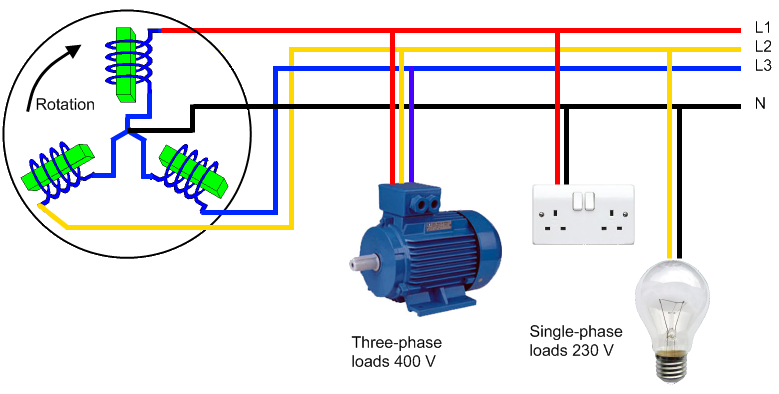
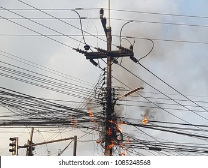

============
Introduction
============

PowerAI represents a cutting-edge solution for automated fault detection and classification in three-phase electrical power systems. By leveraging advanced artificial intelligence and deep learning techniques, this project addresses the critical challenges of maintaining power grid reliability and safety in modern electrical infrastructure.

---

Three-Phase Electrical Systems Overview
========================================

Three-phase electrical systems form the backbone of modern energy distribution infrastructure. These systems consist of three phase conductors (R, S, T) offset by 120° and a neutral conductor, enabling efficient electrical energy transmission.

Key Advantages of Three-Phase Systems:
---------------------------------------

* **Constant Power Transmission:** Provides steady, continuous power delivery
* **Load Balancing:** Ensures optimal distribution of electrical loads
* **Reduced Line Losses:** Minimizes energy waste during transmission
* **Equipment Optimization:** Enables efficient operation of transformers and motors

System Input Data
-----------------

Three-phase systems generate six fundamental electrical signals that contain comprehensive information about system status:

* **3 Phase Currents:** IR, IS, IT (Amperes)
* **3 Phase Voltages:** VR, VS, VT (Volts)

**Information Richness:** These six signals contain all necessary information to precisely characterize system state and identify anomalies with high accuracy.

---

The Critical Need for Fault Detection and Classification
========================================================

Common Fault Types in Power Systems:
-------------------------------------

* **Short Circuits:** Phase-to-ground, phase-to-phase, and three-phase faults
* **Insulation Failures:** Breakdown of protective insulation materials
* **Overloads and Imbalances:** Excessive current or unbalanced loading conditions
* **Electrical Arc Faults:** Dangerous arcing between conductors

Consequences of Undetected Faults:
-----------------------------------

**Safety Risks:**

* Fire hazards and potential explosions
* Electrocution dangers
* Equipment damage and failure

**Economic Impact:**

* Production shutdowns and downtime
* Costly equipment replacement
* Revenue losses due to service interruptions

**Service Quality:**

* Power supply disruptions
* Voltage fluctuations and instabilities

**Regulatory Compliance:**

* Non-compliance with safety standards and regulations
* Potential legal liabilities

Time-Critical Detection Requirements
------------------------------------

**Temporal Challenge:** Fault detection must be instantaneous (within milliseconds) to prevent fault propagation and limit damage to the electrical infrastructure.

---

Why AI Approach vs. Traditional Methods
========================================

Limitations of Traditional Methods
-----------------------------------

Traditional fault detection methods often fall short in modern complex power systems due to several inherent limitations:

**Signal Analysis:**

* Separate processing of current and voltage signals
* Limited correlation analysis between parameters
* Inability to capture complex interdependencies

**Data Processing:**

* Reliance on RMS average values only
* Loss of temporal information and transient details
* Simplified statistical approaches

**Correlation Analysis:**

* Treatment of parameters as isolated variables
* Missing non-linear relationships between signals
* Limited pattern recognition capabilities

**System Calibration:**

* Manual adjustment requirements for each installation
* Static threshold settings
* Inability to adapt to changing system conditions

**Classification Capabilities:**

* Basic fault/no-fault binary classification
* Limited fault type identification
* High false positive rates during system transients

PowerAI's Deep Learning Advantage
----------------------------------

Our innovative AI-powered approach overcomes traditional limitations through:

**Advanced Signal Processing:**

* Simultaneous analysis of all six electrical signals (IR, IS, IT, VR, VS, VT)
* Complete waveform analysis with temporal information preservation
* Multi-dimensional feature extraction and pattern recognition

**Intelligent Data Utilization:**

* Processing of complete waveforms rather than just RMS values
* Temporal sequence analysis for transient behavior understanding
* Advanced signal preprocessing and noise reduction

**Sophisticated Correlation Analysis:**

* Non-linear relationship modeling between all six parameters
* Complex pattern recognition across multiple signal dimensions
* Dynamic correlation analysis adapting to system conditions

**Adaptive Learning:**

* Continuous self-learning and system adaptation
* Automatic threshold adjustment based on operating conditions
* No manual calibration required for different installations

**Precise Classification:**

* Detailed fault type identification and categorization
* Intelligent distinction between real faults and system transients
* Significantly reduced false positive rates
* Predictive capabilities for early fault warning

---

Project Objectives
==================

Primary Goals
-------------

1. **Develop Advanced AI Models:** Create sophisticated neural network architectures capable of real-time fault detection and classification
2. **Achieve High Accuracy:** Minimize false positives while maintaining maximum sensitivity to actual faults
3. **Enable Real-Time Processing:** Ensure millisecond-level response times for critical fault scenarios
4. **Provide Comprehensive Analysis:** Deliver detailed fault classification and system health insights

Expected Outcomes
------------------

* **Improved Power System Reliability:** Reduce unplanned outages and equipment failures
* **Enhanced Safety:** Minimize risks of electrical accidents and equipment damage
* **Cost Reduction:** Lower maintenance costs through predictive fault detection
* **Operational Efficiency:** Streamline power system monitoring and management

---

Next Steps: Data Acquisition and Modeling
=========================================

The foundation of any successful AI system lies in high-quality, representative training data. In the following section, we will explore how we obtained comprehensive fault data through advanced simulation techniques using MATLAB Simulink models.

**→ Continue to:** :doc:`Data Acquisition from Simulink Models <data_acquisition>`

Our next presentation will detail:

* Simulink model development for three-phase power systems
* Fault simulation techniques and scenarios
* Data extraction and preprocessing methods
* Dataset preparation for machine learning training

----

*This introduction provides the foundation for understanding PowerAI's innovative approach to electrical fault detection. The combination of deep learning techniques with comprehensive electrical system knowledge enables unprecedented accuracy and reliability in power system protection.*